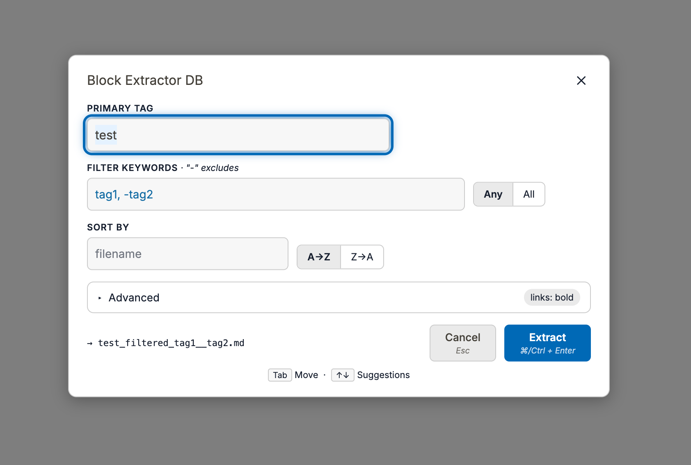
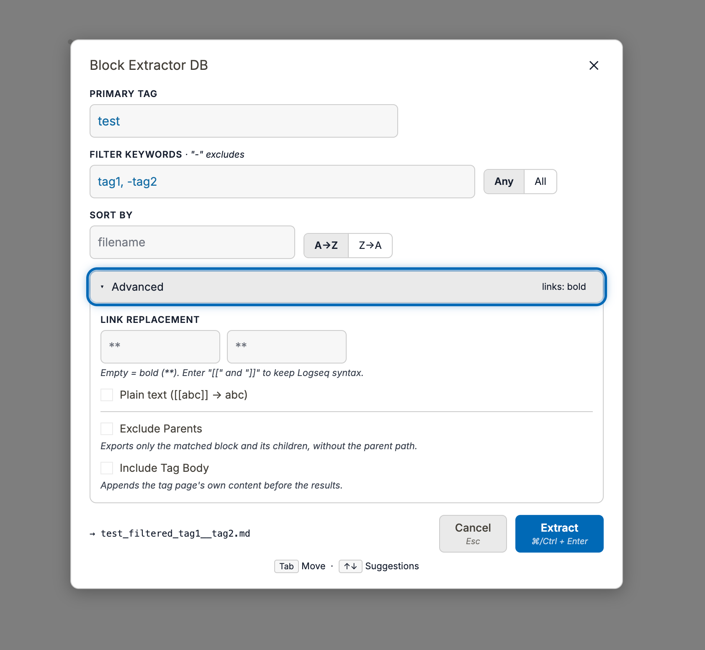

# Block Extractor DB

  

  


A [Logseq](https://logseq.com) plugin that filters the reference blocks for a specific tag/page and downloads them as a markdown file — **built for Logseq DB graphs (Logseq 2.x beta, sqlite-based)**.

This is the DB-graph counterpart of [logseq-block-extractor](https://github.com/inchanS/logseq-block-extractor). For file-based (markdown) graphs, use the original plugin.

[한국어 문서 (Korean)](./README-KR.md)

## Why a separate plugin?

Logseq 2.x DB graphs store data in sqlite/datascript with a different schema, so the original plugin's queries and content handling no longer work:

| | File-based graph | DB graph (this plugin) |
|---|---|---|
| Block text | `:block/content` | `:block/title` (raw text holds `[[uuid]]` ref tokens) — the plugin uses the SDK-resolved `full-title` |
| Tag references | `[[Tag]]` / `#Tag` → `:block/refs` | `[[Tag]]` → `:block/refs`, `#Tag` → `:block/tags` (both are queried) |
| Properties | `key:: value` text in blocks | First-class DB entities (`:user.property/*`), read via `getPageProperties` |
| Tagged pages | n/a | Pages tagged with `#Tag` (objects) are included as results with their full content |
| Numbered lists | `logseq.order-list-type::` text | `:logseq.property/order-list-type` property |

## Features

- Extract every block (and page) that references a **primary tag**, keeping the block hierarchy
- **Keyword filter** with include / exclude (`-keyword`) and Any/All match modes
- **Sort** by page name, `created-at`, `updated-at`, `journal-day`, or any user property
- **Link replacement**: `[[link]]` / `#[[multi word tag]]` → bold, plain text, custom wrappers, or kept as-is
- Optional: include the tag page's own content, exclude parent paths
- Autocomplete for tags, keywords, and sort properties
- Downloads the result as a `.md` file

## Installation (manual, while in beta)

1. `npm install && npm run build`
2. In Logseq: **Settings → Advanced → Developer mode** on
3. **Plugins → Load unpacked plugin** → select this folder

## Usage

Open the dialog via:

- Toolbar download button
- Command palette: `Extract Filtered Blocks` (`mod+shift+e`)
- Slash command `/Extract Filtered Blocks` or the block context menu

## Development

```bash
npm run dev     # vite dev server
npm run watch   # rebuild on change
npm test        # vitest
npm run pack    # build + zip for release
```

## Requirements

- Logseq 2.0.x beta (DB graph)
- `@logseq/libs` ^0.3.4

## License

GPL-3.0
